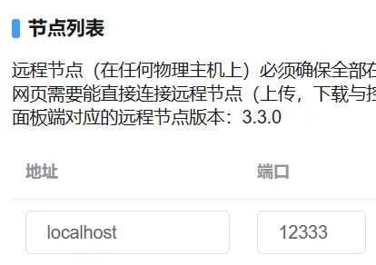

[<=点此返回README](README.md)

***
# 配置 HTTP 反向代理且合并Web面板与守护节点的端口

> 合并端口通常仅用于Web面板与守护进程在同一主机的情况。  
> 本文基于 [配置HTTP反向代理](配置HTTP反向代理.md) 进行修改。  
> 若您需要 HTTPS 反向代理且合并端口，请参考 [配置HTTPS反向代理且合并端口](配置HTTPS反向代理且合并端口.md) 。  
> 本文**不是**MCSManager官方开发人员写的。  
> ⚠ 使用HTTP协议可能导致毫不知情的遭到网页内容**篡改**、**窃取**连接内容。

注释：  
> 本地回环地址：例如域名 ***localhost*** 或IPv4 ***127.0.0.1*** 。  
> 守护进程：意思同守护节点、Daemon节点、Daemon进程、Daemon端。  

<br />

## 合并端口的原理

MCSManager访问守护进程的路径开头（与Web面板路径开头不冲突）：  
> /socket.io/  
> /upload/  
> /download/  

Nginx里的location匹配优先级从高到低是：  
```nginx
location =/test.txt {}              # 匹配完全相等的路径
location ~ (^/path/)|(^/path2/) {}  # 匹配正则表达式
location /path/ {}                  # 匹配单个路径开头
```

依据这些特性，将两者端口合并，以减少公网监听端口数量。   

<br />

## 配置反向代理

> <a href="https://proxyformcsm.bddjr.com/generator.html?https=0&mergeports=1" target="_blank">配置文件的主要参数改起来有些麻烦？试试这款生成器吧！</a>  

以下示范内容的测试环境：  
> ***CentOS*** 操作系统  
> 使用yum安装的Nginx ***1.20.1***  
> 配置文件目录 ***/etc/nginx/nginx.conf***  
> Web面板 ***9.8.0***  
> 守护进程 ***3.3.0***  

```nginx
# For more information on configuration, see:
#   * Official English Documentation: http://nginx.org/en/docs/
#   * Official Russian Documentation: http://nginx.org/ru/docs/

user nginx;
worker_processes auto;
error_log /var/log/nginx/error.log;
pid /run/nginx.pid;

# Load dynamic modules. See /usr/share/doc/nginx/README.dynamic.
include /usr/share/nginx/modules/*.conf;

events {
    worker_connections 1024;
}

# 以上内容可能已经包含在nginx.conf里，确保目录在您的操作系统中有效即可。
#=======================================================================
# 以下才是需要理解并修改的内容，请依据自己的需求以及运行环境进行更改。
# 假设：
#    只需监听IPv4的端口
#    Daemon端真正监听的端口：24444
#    Web面板端真正监听的端口：23333
#    代理后端口：12333
#    需要允许主域名 domain.com 及其任意子域名访问

http {
    # 传输时默认开启gzip压缩
    gzip on;
    # 传输时会被压缩的类型（应当依据文件压缩效果添加）
    gzip_types text/plain text/css application/javascript application/xml application/json;
    # 反向代理时，启用压缩
    gzip_proxied any;
    # 传输时压缩等级，等级越高压缩消耗CPU越多，最高9级，通常5级就够了
    gzip_comp_level 5;
    # 传输时大小达到1k才压缩，压缩小内容无意义
    gzip_min_length 1k;

    # 响应头中的server仅返回nginx，不返回版本号。
    server_tokens  off;

    # 不限制客户端上传文件大小
    client_max_body_size 0;

    server {
        # 这块是用于阻止跨域访问的。

        # 代理后端口（可用多个listen监听多个端口）
        listen 12333 default ;

        # 若使用的域名在其它server{}中都无法匹配，则会匹配这里。
        server_name _ ;

        # 断开连接。
        return 444;
    }
    server {
        # Daemon 端代理后localhost访问HTTP协议端口（可用多个listen监听多个端口）
        listen 127.0.0.1:12333 ;

        # 本地回环域名
        server_name localhost ;

        # 本地回环地址不占宽带，无需压缩。
        gzip off;

        # 开始反向代理
        # 代理Daemon节点
        location / {
            # 填写Daemon进程真正监听的端口号
            proxy_pass http://localhost:24444 ;

            # 一些请求头
            proxy_set_header Host $host;
            proxy_set_header X-Real-IP $remote_addr;
            proxy_set_header X-Forwarded-For $proxy_add_x_forwarded_for;
            proxy_set_header REMOTE-HOST $remote_addr;
            # 用于WebSocket的必要请求头
            proxy_set_header Upgrade $http_upgrade;
            proxy_set_header Connection "upgrade";
            # 增加响应头
            add_header X-Cache $upstream_cache_status;
            # 禁止客户端缓存，防止客户端未更新内容
            expires -1;
        }
    }
    server {
        # 代理后的公网访问HTTP协议端口（可用多个listen监听多个端口）
        listen 12333 ;

        # 你访问时使用的域名（支持通配符，但通配符不能用于根域名）
        server_name domain.com *.domain.com ;

        # 此处无需单独返回 robots.txt ，面板已包含该文件。

        # 开始反向代理
        # 代理Daemon节点
        location ~ (^/socket.io/)|(^/upload/)|(^/download/) {
            # 填写Daemon进程真正监听的端口号，后面不能加斜杠！
            proxy_pass http://localhost:24444 ;

            # 一些请求头
            proxy_set_header Host $host;
            proxy_set_header X-Real-IP $remote_addr;
            proxy_set_header X-Forwarded-For $proxy_add_x_forwarded_for;
            proxy_set_header REMOTE-HOST $remote_addr;
            # 用于WebSocket的必要请求头
            proxy_set_header Upgrade $http_upgrade;
            proxy_set_header Connection "upgrade";
            # 增加响应头
            add_header X-Cache $upstream_cache_status;
            # 禁止客户端缓存，防止客户端未更新内容
            expires -1;
        }
        # 代理Web端
        location / {
            # 填写Web面板端真正监听的端口号
            proxy_pass http://localhost:23333 ;

            # 一些请求头
            proxy_set_header Host $host;
            proxy_set_header X-Real-IP $remote_addr;
            proxy_set_header X-Forwarded-For $proxy_add_x_forwarded_for;
            proxy_set_header REMOTE-HOST $remote_addr;
            # 用于WebSocket的必要请求头
            proxy_set_header Upgrade $http_upgrade;
            proxy_set_header Connection "upgrade";
            # 增加响应头
            add_header X-Cache $upstream_cache_status;
            # 禁止客户端缓存，防止客户端未更新内容
            expires -1;
        }
    }
}
```

**配置完成后，重启 Nginx 服务（以下命令用于Linux操作系统）**
```bash
systemctl restart nginx
```

<br />

## 客户端访问面板

假如域名是 ***domain.com*** ，反向代理后的端口是12333，那么浏览器需要使用这个地址访问面板：
```
http://domain.com:12333/
```

**⚠请确保反向代理后的端口都通过了服务器的防火墙，否则您是无法正常访问的。**  

<br />

## 连接守护进程

假如Web面板后台通过 ***localhost*** 域名连接节点，那么在**节点管理**中填写地址为 ***localhost*** 或 ***ws://localhost*** ，端口填写反向代理后的端口号（例如12333），然后单击右侧的 **连接** 或 **更新** 即可。  
假如需要填远程地址 ***domain.com*** ，那么将 ***localhost*** 改为 ***domain.com*** 即可。



<br />

## 恭喜你，基础配置完成了！

为了安全，您应当在防火墙中，禁止通过以下端口访问：
> Web面板端真正监听的端口（例如23333）  
> Daemon端真正监听的端口（例如24444） 

（本地回环地址不受防火墙限制）

<br />

***
## 非常感谢您能阅读我写的教程，希望对你有帮助！
有错误的内容或改进的建议？或者没弄懂怎么配置？[点此编辑并提交issue](../../issues/new)。  

### 想要分享该文档？  
Gitee 仓库：  
```
https://gitee.com/bddjr/nginx-proxy-docs-for-mcsm/blob/master/配置HTTP反向代理且合并端口.md
```
Github 仓库：  
```
https://github.com/bddjr/nginx-proxy-docs-for-mcsm/blob/master/配置HTTP反向代理且合并端口.md
```
Github Page + Cloudflare CDN 网页：  
```
https://proxyformcsm.bddjr.com/配置HTTP反向代理且合并端口
```

***
[<=点此返回README](README.md)

> 源码仓库：<a href="https://github.com/bddjr/nginx-proxy-docs-for-mcsm" target="_blank">nginx-proxy-docs-for-mcsm</a><br/>
> Made by <a href="https://bddjr.cn" target="_blank" rel="noopener">bddjr</a>
